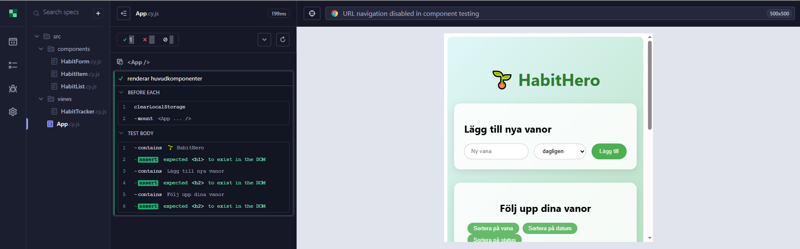
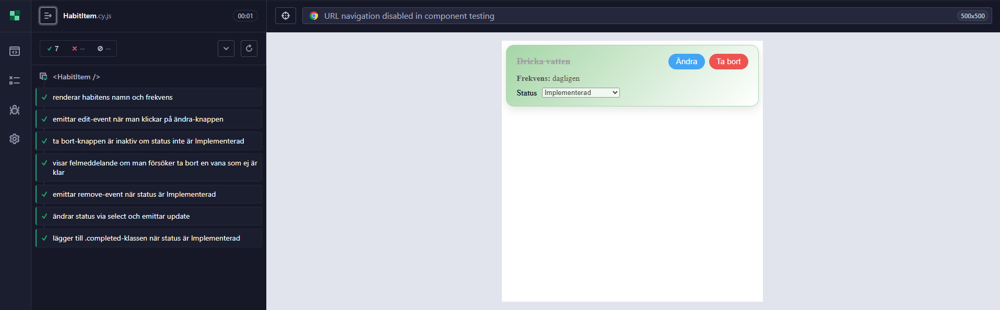
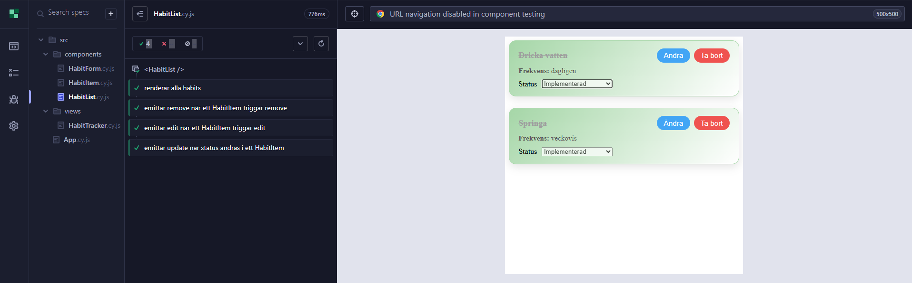

# Inlämning 2 i kursen Testning - E2E

Uppgiften examinerar följande moment från kursplanen:

* Tekniker för att kvalitetssäkra kod
* Hur testverktyg kan användas
* Genomföra End-to-end-tester för att upptäcka och åtgärda buggar

## Uppgiftsbeskrivning
* Din uppgift är att skapa en enkel to do-app i valfritt ramverk, och E2E-testa den.
* Det går bra att använda färdig kod från tidigare projekt/internet/AI, ta t.ex. hjälp av TodoMVC - ni hittar källkodslänkar till vänster när ni har valt ramverk. Du behöver inte skriva To Do-appen från scratch; fokus är på testning.
* To do-appen ska innehålla följande funktioner:
    * Kunna lägga till en todo
    * Kunna ta bort en todo, men endast om den är klar (inte en användarvänlig funktion, men för att kunna skriva ett test som verifierar att detta fungerar)
    * Kunna markera en todo som klar
    * Kunna avmarkera en todo som klar
    *  Ha 2 exempeltodos i listan från början, där en är färdig och den andra ofärdig
* Skriv tester med hjälp av Cypress för att verifiera att flödet fungerar:
    * Applikationen startar/visar något (mount)
    * Det finns 2 uppgifter där en är klar och den andra inte är det
    * Det går att lägga till en todo
    * Det går att ta bort en todo
    * Det går att "toggla state" för todon
* Göra en (utförlig) README till ditt repo som demonstrerar dina resultat, inkl. skärmdumpar på samtliga tester (att de har gått igenom).

#### Syfte med uppgiften
* Förstå hela flödet för testning, från start till mål
* Kunna använda ett E2E-testverktyg
* Förstå och fatta beslut kring tekniker för att kvalitetssäkra kod
* Åtgärda buggar

## Bedömning
#### För G
* Du har utfört uppgiften enligt specifikationen ovan

# Uppgiftsanteckningar
## Printbilder från Cypress

App.cy.js

HabitForm.cy.js

HabitItem.cy.js

HabitList.cy.js

HabitTracker.cy.js

## Installation av projektet  
#### Initierar projektet
1. npm init
2. npm create vite@latest .  
(Valde Vue och Javascript i detta projekt)

#### Initierar routing på sidan
npm install vue-router

#### Installation av Cypress
1. npm add --save-dev cypress
2. Lade till "cypress": "cypress open" i package.json under script.
3. npx cypress open

#### Kör projektet
1. npm install
2. npm run dev